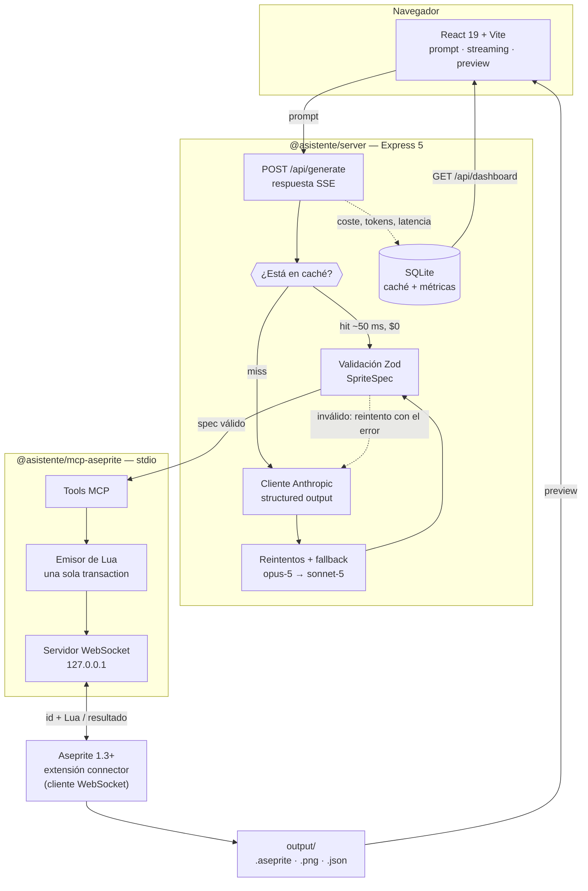
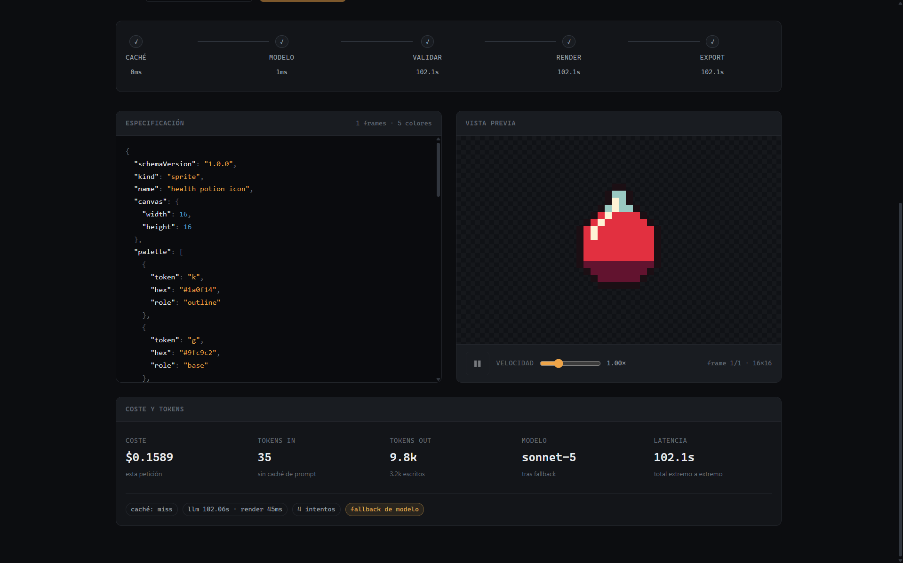
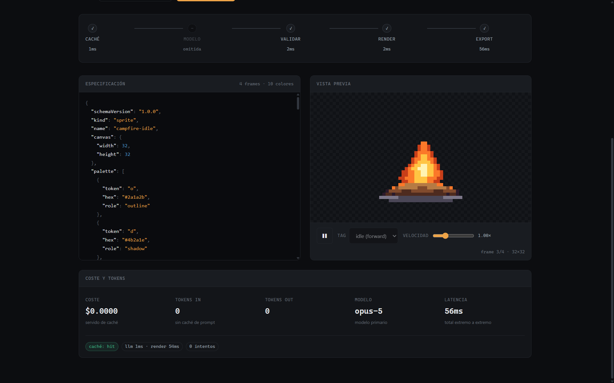
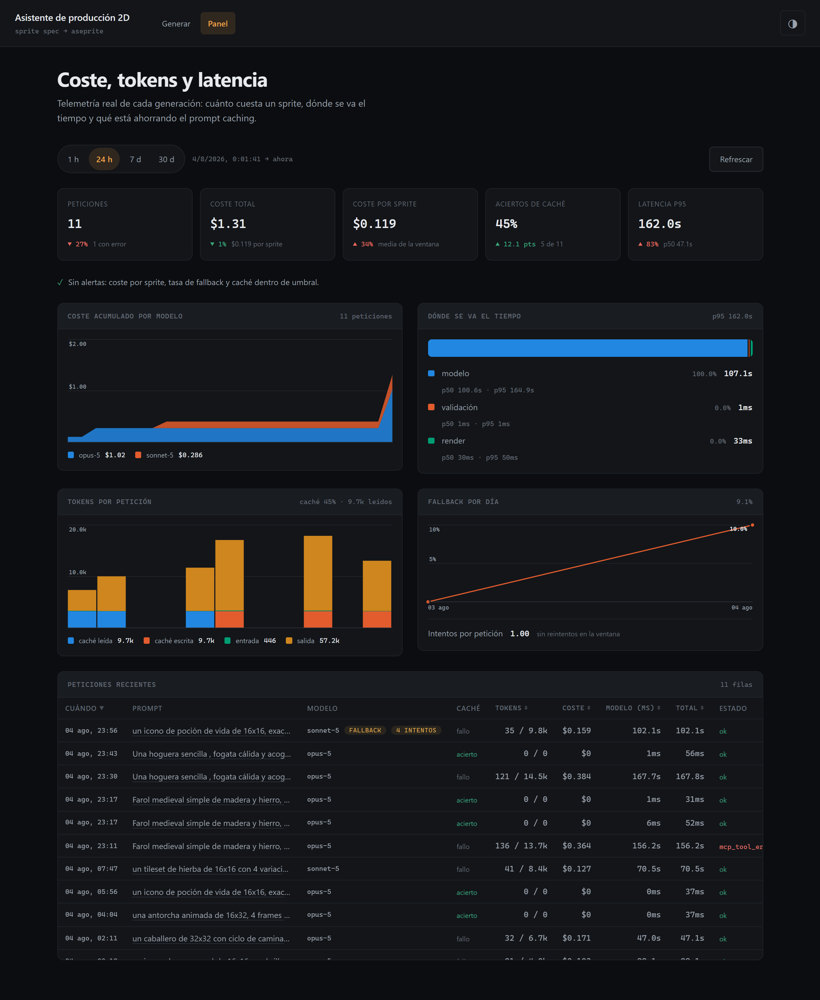
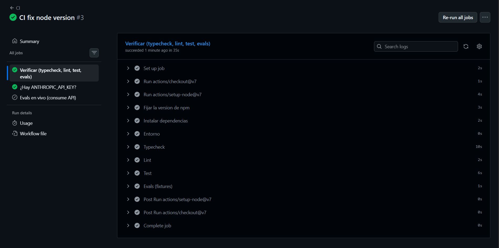
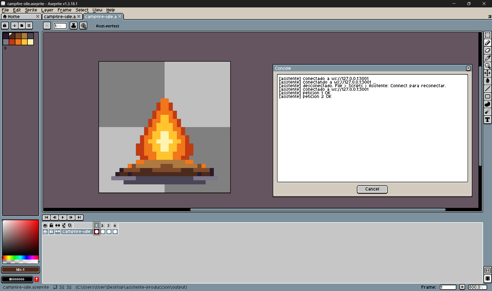
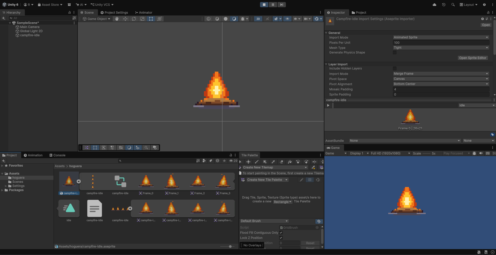

# Asistente de producción de pixel art

Convierte una descripción en lenguaje natural en un sprite o tileset real, generado dentro de
Aseprite a través de un servidor MCP propio. El pixel art es el resultado visible; lo que este
repositorio demuestra es la ingeniería que hay alrededor del modelo: streaming, salidas
estructuradas validadas, uso de herramientas, reintentos con fallback entre modelos, caché
propia, telemetría de coste y latencia, y una suite de evaluación que rompe el build. Cada una de
esas piezas existe para resolver un problema concreto de llevar un LLM a producción, y abajo se
explica cuál.

https://github.com/user-attachments/assets/462b58ec-4025-47c0-888f-76507bd3c488

---

## Arquitectura



El modelo nunca toca el disco ni ejecuta nada. Produce un `SpriteSpec` en JSON; el servidor lo
valida y, sólo si es válido, el MCP lo traduce a Lua. Esa frontera es lo que permite tratar la
salida del modelo como entrada hostil.

---

## Capacidades

### Streaming por SSE

**El problema:** generar un sprite tarda entre 80 y 170 segundos. Una petición HTTP normal deja
la interfaz en blanco todo ese tiempo, sin forma de saber si avanza o se colgó.

La respuesta viaja como Server-Sent Events con eventos por etapa, así que la interfaz muestra el
spec formándose token a token y después el progreso del render.

Dos estados que parecen uno y no lo son: *el cliente colgó* y *la respuesta terminó*. Se escuchan
por separado, y el cierre del stream ocurre siempre en un `finally` — si se marca cerrado al
detectar la desconexión, la respuesta se queda colgada para siempre. La desconexión se escucha en
`res` y no en `req`, porque el `close` de `req` salta en cuanto se termina de leer el cuerpo, que
en un POST es inmediato.

→ [`packages/server/src/routes/generate.ts`](packages/server/src/routes/generate.ts)

### Salidas estructuradas

**El problema:** pedirle JSON a un modelo y parsearlo con `JSON.parse` falla en producción. Llega
envuelto en markdown, con un campo de más o con un entero donde se esperaba un enum.

El schema se define una vez con Zod y se deriva a JSON Schema para la API. La validación de
entrada y el contrato con el modelo no pueden desincronizarse porque son la misma fuente.

Un detalle que no es evidente: Zod v4 emite `minimum`/`maximum` al usar `.int()`, y
`minLength`/`pattern` con `.min()`/`.regex()`. Esas keywords rompen los structured outputs de la
API. Por eso los campos que viajan al JSON Schema usan sólo validadores estructurales, y los
rangos y formatos viven en un `superRefine` que corre del lado del servidor. Lo verifica un test
dedicado, `assertStructuredOutputCompatible`.

→ [`packages/shared/src/schema/sprite-spec.ts`](packages/shared/src/schema/sprite-spec.ts)

### Uso de herramientas vía MCP

**El problema:** que el modelo "dibuje" significa ejecutar código en una aplicación de escritorio.
Dejarle generar Lua libre sería ejecución arbitraria de código.

El modelo sólo produce datos. Un servidor MCP por stdio expone herramientas tipadas que traducen
el `SpriteSpec` a Lua, y todo el lote va en **una sola** `app.transaction`: cientos de llamadas
sueltas serían cientos de round-trips y otros tantos pasos de deshacer.

Todo nombre de fichero derivado del modelo pasa por `path.basename` con el separador normalizado
y se verifica confinado al directorio de salida antes de usarse.

→ [`packages/mcp-aseprite/src/tools.ts`](packages/mcp-aseprite/src/tools.ts) ·
[`lua/emit.ts`](packages/mcp-aseprite/src/lua/emit.ts) ·
[`output-paths.ts`](packages/mcp-aseprite/src/output-paths.ts)

### El puente hacia Aseprite

**El problema:** la API Lua de Aseprite trae cliente WebSocket, pero no servidor. Y no incluye
librería JSON.

Node levanta el servidor en `127.0.0.1` y Aseprite se conecta como cliente, así que el lado Node
arranca primero. El sobre viaja como `"<id>\n<lua>"` y la respuesta se construye a mano con un
escapador mínimo; quien parsea es Node, que sí tiene `JSON.parse` fiable.

El connector es una **extensión**, no un script: un script lanzado desde `File > Scripts` termina
en su última línea, sus locales quedan libres para el recolector y el callback deja de dispararse,
dejando un socket abierto pero sordo.

→ [`packages/mcp-aseprite/src/bridge/ws-server.ts`](packages/mcp-aseprite/src/bridge/ws-server.ts) ·
[`aseprite/README.md`](aseprite/README.md)

### Reintentos y fallback entre modelos

**El problema:** la API devuelve 429 y 529 bajo carga, y un modelo puede declinar una petición.
Sin una política explícita, eso es un error en la cara del usuario.

Reintentos con backoff exponencial sobre los códigos recuperables, y fallback de `claude-opus-5`
a `claude-sonnet-5` cuando el primario no responde. El fallback server-side no lo admiten todos
los modelos —sólo los que pueden declinar por clasificador—, así que se decide por modelo en
`supportsServerSideFallback()`.

`SIMULATE_5XX=1` fuerza el fallo del primario para poder demostrarlo sin esperar a una caída real.

→ [`packages/server/src/llm/retry.ts`](packages/server/src/llm/retry.ts) ·
[`fallback.ts`](packages/server/src/llm/fallback.ts)



### Caché de respuestas

**El problema:** el prompt caching de Anthropic abarata el prefijo de una petición que igualmente
se ejecuta. No evita la petición.

Esta caché es complementaria, no un sustituto: guarda el `SpriteSpec` completo en SQLite y evita
la llamada entera. Un acierto convierte una operación de ~102 segundos y ~$0,21 en una de ~50 ms
y coste cero.

La clave es `sha256` del prompt normalizado más la versión del schema, el modelo y el hash del
system prompt: cambiar el schema o el prompt invalida las entradas viejas sin purgarlas a mano.
Los campos se unen con un separador `\u0000`, que no puede aparecer dentro de ninguno — sin él,
`["ab","c"]` y `["a","bc"]` colisionarían.

→ [`packages/server/src/cache/response-cache.ts`](packages/server/src/cache/response-cache.ts)



### Telemetría de coste y latencia

**El problema:** sin medirlo, el coste de un sistema con LLM se descubre en la factura.

Cada petición registra tokens, coste estimado a partir de una tabla de precios versionada,
latencia por etapa, intentos, si hubo fallback y si fue acierto de caché. El panel agrega por
ventana y compara con la anterior.

Dos decisiones que cambian lo que se lee: los percentiles de LLM **excluyen** los aciertos de
caché y los de render excluyen los ceros —meter esos ceros hunde el p50 y finge una mejora que no
existe—; y las alertas basadas en proporciones exigen un mínimo de evidencia, porque con siete
peticiones en la ventana un solo fallback da 14 % y cruza cualquier umbral razonable sin describir
nada real.

→ [`packages/server/src/telemetry/dashboard.ts`](packages/server/src/telemetry/dashboard.ts) ·
[`shared/src/pricing.ts`](packages/shared/src/pricing.ts)



### Evaluación automatizada

**El problema:** "el sprite se ve bien" no es una medida. Sin una, cualquier cambio en el prompt
es una apuesta.

Casos fijos y graders **deterministas** —ninguno usa LLM-as-judge: un grader que llama al modelo
mete ruido y coste en la medida que sirve para juzgar al modelo—. `thresholds.json` decide el
código de salida; `baseline.json` sólo marca regresiones sin romper el build.

Los graders no abren Aseprite: operan sobre el `SpriteSpec` y sobre el Lua emitido, para poder
correr en un runner sin GUI.

→ [`evals/README.md`](evals/README.md) · [`evals/thresholds.json`](evals/thresholds.json)

### Integración continua

El job de validación corre en cada PR **sin clave de API y sin coste**: las evals usan respuestas
grabadas. El job de evals en vivo va aparte y no corre en pull requests, porque un PR de un fork
no puede leer secretos y toda contribución externa nacería en rojo.

→ [`.github/workflows/ci.yml`](.github/workflows/ci.yml)



---

## Números medidos

De las peticiones **reales** registradas en la telemetría. Muestra pequeña (**n = 8**, 7
entregadas y 1 error), así que valen como orden de magnitud, no como estadística.

| Métrica | Valor |
|---|---|
| Coste medio por sprite generado | **$0,2108** (n = 4 pagados) |
| Coste medio por sprite entregado | $0,1724 (n = 7, incluye aciertos de caché) |
| Latencia LLM p50 / p95 | **102,1 s** / 165,4 s |
| Latencia con acierto de caché | 31–56 ms |
| Aceleración por caché | **~1.960×** |
| Render en Aseprite (p50) | 42 ms |
| Tasa de acierto de caché | 37,5 % (3 de 8) |
| Gasto total registrado | $1,2067 |

El LLM domina la latencia por tres órdenes de magnitud sobre el render: optimizar el pintado no
serviría de nada, y por eso el esfuerzo está en la caché.

> **Sobre los fixtures.** Los fixtures que hay en el repo son `synthetic-seed`: specs válidos y
> representativos escritos a mano para que la suite arranque en un clon sin clave de API. **No**
> son respuestas de llamadas reales, y sus cifras (≈$0,03 por sprite, p95 ≈19 s) no reflejan el
> coste ni la latencia de producción. Los presupuestos de `thresholds.json` están calibrados
> contra ellos; una corrida en vivo con los valores reales de arriba incumpliría ambos. Regraba
> los fixtures con `npm run evals:record` antes de sacar conclusiones sobre calidad o coste.

---

## Decisiones y compromisos

| Decisión | Alternativa | Por qué |
|---|---|---|
| **SQLite** para caché y métricas | MongoDB, Postgres | El sistema es local-first y monousuario. Un fichero sin servicio que administrar, con consultas de agregación suficientes. Una base gestionada añadiría operación sin resolver ningún problema real aquí. |
| **Local-first**, sin despliegue | Vercel, contenedores | El producto necesita una instancia de Aseprite de escritorio con una extensión instalada. No hay forma de servir eso desde una función serverless, así que desplegarlo sería una demo sin la mitad interesante. |
| **Caché propia** además del prompt caching | Sólo prompt caching de Anthropic | Resuelven cosas distintas: el de Anthropic abarata el prefijo de una petición que igualmente se ejecuta; el propio evita la llamada entera. Medido: ~102 s → ~50 ms. |
| **Graders deterministas**, sin LLM-as-judge | Juez con modelo | Un juez LLM mete ruido y coste en la medida que sirve para juzgar al modelo, y su veredicto no es reproducible entre corridas. |
| **MCP por stdio** | Llamadas HTTP a un servicio propio | El protocolo ya define el contrato de herramientas y el ciclo de vida del proceso. Y stdio evita exponer un puerto para algo que sólo consume un proceso local. |
| **Zod → JSON Schema** desde una fuente | Schema JSON escrito a mano | Con dos fuentes, la validación de entrada y el contrato con el modelo se desincronizan en silencio. |
| **Versión de npm fijada** en CI | Sólo fijar Node | npm 10 y 11 no validan igual un `package-lock.json`. Fijar sólo Node deja que el runner use el npm que traiga ese día, y el lockfile puede estar en verde en local y romper `npm ci` en CI. |

---

## Puesta en marcha

Requiere **Node 22+** y **Aseprite 1.3 o superior** (las versiones anteriores no exponen
`WebSocket` en su API Lua).

1. **Instalar dependencias** desde la raíz:

   ```bash
   npm install
   ```

2. **Configurar la credencial.** Copia `.env.example` a `.env` y rellena `ANTHROPIC_API_KEY`.

   Una suscripción de Claude.ai (Pro/Max) **no** da acceso a la API: son productos distintos con
   facturación distinta. La clave se crea en
   [console.anthropic.com](https://console.anthropic.com/settings/keys).

3. **Instalar la extensión de Aseprite:**

   ```powershell
   $dest = "$env:APPDATA\Aseprite\extensions\asistente-connector"
   New-Item -ItemType Directory -Force -Path $dest | Out-Null
   Copy-Item -Force aseprite\extension\asistente-connector\* $dest
   ```

   Reinicia Aseprite. La primera vez mostrará un diálogo de seguridad porque la extensión abre una
   conexión de red: acéptalo, o el connector no podrá conectarse. Detalles y alternativa
   empaquetada en [`aseprite/README.md`](aseprite/README.md).

4. **Arrancar el backend.** Levanta el puente WebSocket, así que va antes que Aseprite:

   ```bash
   npm run dev -w @asistente/server
   ```

5. **Conectar Aseprite:** `File > Asistente: Connect`. Hay que repetirlo cada vez que se reinicie
   el lado Node, porque el puente es nuevo; no hace falta reiniciar Aseprite.

6. **Arrancar la interfaz:**

   ```bash
   npm run dev -w @asistente/web
   ```

   Generar en `http://localhost:5173/#/` · panel de métricas en `http://localhost:5173/#/panel`.

Para comprobar la cadena completa (MCP → Lua → Aseprite) **sin gastar API**:

```bash
npm run render:example -w @asistente/server   # genera un icono de 8×8 en output/
```

Y para ver el panel con datos sin llamar al modelo:

```bash
npm run seed:metrics -w @asistente/server
```



Los spritesheets se exportan con su JSON de metadatos, listos para importar como Sprite Sheet
múltiple:



---

## Verificación

```bash
npm run typecheck      # tsc --noEmit en los 5 workspaces
npm run lint           # eslint, sin warnings
npm run test           # vitest en cada workspace
npm run build          # build de cada paquete
npm run ci:local       # réplica exacta del job de PR
npm run evals:fixtures # suite offline: sin red, sin clave, sin coste
npm run evals:record   # suite en vivo, regraba fixtures — consume API
```

---

## Estructura

| Paquete | Rol |
|---|---|
| [`packages/shared`](packages/shared) | Schemas Zod (`SpriteSpec`), tipos, tabla de precios, versionado del schema. No importa de ningún otro paquete. |
| [`packages/server`](packages/server) | Express 5 + SSE. Cliente Anthropic, caché, cliente MCP, telemetría y rutas HTTP. |
| [`packages/web`](packages/web) | React 19 + Vite + CSS Modules. Prompt, streaming, preview y panel. |
| [`packages/mcp-aseprite`](packages/mcp-aseprite) | Servidor MCP por stdio. Traduce el spec a Lua y lo ejecuta en Aseprite por WebSocket. |
| [`evals`](evals) | Casos fijos, graders deterministas, umbrales y runner. |
| [`aseprite/extension`](aseprite/extension/asistente-connector) | La extensión que se instala en Aseprite. |

TypeScript estricto en todo el monorepo: `strict`, `noUncheckedIndexedAccess` y
`exactOptionalPropertyTypes`.

### Endpoints

| Ruta | Qué hace |
|---|---|
| `POST /api/generate` | Genera un sprite. Responde por SSE con eventos de etapa. |
| `GET /api/dashboard` | Agregados, series y alertas de una ventana temporal. |
| `GET /api/metrics` | Métricas crudas. |
| `GET /api/assets/:file` | Sirve los PNG y JSON generados. Sólo esas extensiones, confinado al directorio de salida. |
